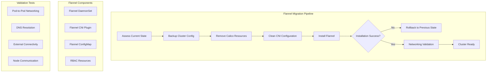

# Design Document - Flannel Network Migration

## Overview

This design addresses the Calico CustomResourceDefinition annotation size limit error by migrating from Calico to Flannel as the Container Network Interface (CNI) plugin. Flannel is simpler, more stable, and doesn't have the CRD complexity that causes annotation size issues. The solution includes safe Calico removal, Flannel installation, and comprehensive validation.

## Architecture

### High-Level Architecture



### Technology Stack

- **Network Plugin**: Flannel (stable, lightweight CNI)
- **Installation Method**: kubectl apply with official Flannel manifest
- **Pod Network CIDR**: 10.244.0.0/16 (Flannel default)
- **Validation Tools**: kubectl, ping, nslookup, curl
- **Migration Tools**: Bash scripting with safety checks
- **Cleanup Tools**: kubectl delete with proper resource ordering

## Components and Interfaces

### 1. Calico Cleanup Manager

**Purpose**: Safely remove all Calico resources and configurations

**Interface**:
```bash
# Function to remove Calico resources
cleanup_calico_resources() {
    echo "Removing Calico resources..."
    
    # Remove Calico pods and deployments
    kubectl delete -f /tmp/tigera-operator.yaml --ignore-not-found=true
    
    # Remove Calico CRDs
    kubectl get crd | grep -E "(tigera|calico)" | awk '{print $1}' | xargs -r kubectl delete crd
    
    # Remove Calico namespaces
    kubectl delete namespace tigera-operator --ignore-not-found=true
    kubectl delete namespace calico-system --ignore-not-found=true
    kubectl delete namespace calico-apiserver --ignore-not-found=true
}

# Function to clean CNI configuration
cleanup_cni_config() {
    # Remove CNI configuration files on all nodes
    for node in $(kubectl get nodes -o name); do
        kubectl debug $node -it --image=busybox -- rm -f /host/etc/cni/net.d/*calico*
        kubectl debug $node -it --image=busybox -- rm -f /host/opt/cni/bin/calico*
    done
}
```

### 2. Flannel Installation Engine

**Purpose**: Install Flannel CNI plugin with proper configuration

**Components**:
- Flannel DaemonSet deployment
- CNI configuration setup
- RBAC resource creation

**Interface**:
```bash
# Primary Flannel installation method
install_flannel() {
    echo "Installing Flannel CNI plugin..."
    
    # Apply Flannel manifest
    kubectl apply -f https://github.com/flannel-io/flannel/releases/latest/download/kube-flannel.yml
    
    # Wait for Flannel pods to be ready
    kubectl wait --for=condition=ready pod -l app=flannel -n kube-flannel --timeout=300s
}

# Alternative installation with custom configuration
install_flannel_custom() {
    local pod_cidr=${1:-"10.244.0.0/16"}
    
    # Download and customize Flannel manifest
    curl -s https://github.com/flannel-io/flannel/releases/latest/download/kube-flannel.yml | \
    sed "s|10.244.0.0/16|${pod_cidr}|g" | \
    kubectl apply -f -
}

# Verify Flannel installation
verify_flannel_installation() {
    # Check if Flannel DaemonSet is ready
    kubectl get daemonset -n kube-flannel kube-flannel-ds
    
    # Verify Flannel pods are running on all nodes
    local node_count=$(kubectl get nodes --no-headers | wc -l)
    local flannel_count=$(kubectl get pods -n kube-flannel -l app=flannel --no-headers | grep Running | wc -l)
    
    if [ "$node_count" -eq "$flannel_count" ]; then
        echo "Flannel successfully deployed on all nodes"
        return 0
    else
        echo "Flannel deployment incomplete: $flannel_count/$node_count nodes"
        return 1
    fi
}
```

### 3. Cluster State Manager

**Purpose**: Backup and restore cluster networking state

**Interface**:
```bash
# Backup current cluster state
backup_cluster_state() {
    local backup_dir="/tmp/k8s-backup-$(date +%Y%m%d-%H%M%S)"
    mkdir -p "$backup_dir"
    
    # Backup current CNI configuration
    kubectl get pods -A -o yaml > "$backup_dir/all-pods.yaml"
    kubectl get nodes -o yaml > "$backup_dir/nodes.yaml"
    kubectl get networkpolicies -A -o yaml > "$backup_dir/networkpolicies.yaml"
    
    echo "Cluster state backed up to: $backup_dir"
    echo "$backup_dir" > /tmp/last-backup-path
}

# Restore cluster state if needed
restore_cluster_state() {
    local backup_dir=$(cat /tmp/last-backup-path 2>/dev/null)
    
    if [ -d "$backup_dir" ]; then
        echo "Restoring cluster state from: $backup_dir"
        # Restore network policies
        kubectl apply -f "$backup_dir/networkpolicies.yaml" --ignore-not-found=true
        echo "Cluster state restoration completed"
    else
        echo "No backup found for restoration"
        return 1
    fi
}
```

### 4. Networking Validation Suite

**Purpose**: Comprehensive testing of Flannel networking functionality

**Components**:
- Pod deployment tests
- Inter-node communication tests
- DNS resolution tests
- External connectivity tests

**Interface**:
```bash
validate_flannel_networking() {
    echo "Validating Flannel networking..."
    
    # Create test pods on different nodes
    create_test_pods
    
    # Test pod-to-pod communication
    test_pod_to_pod_communication
    
    # Test DNS resolution
    test_dns_resolution
    
    # Test external connectivity
    test_external_connectivity
    
    # Cleanup test resources
    cleanup_test_resources
}

create_test_pods() {
    # Create test pods on different nodes
    kubectl run test-pod-1 --image=busybox --restart=Never --command -- sleep 3600
    kubectl run test-pod-2 --image=busybox --restart=Never --command -- sleep 3600
    
    # Wait for pods to be ready
    kubectl wait --for=condition=ready pod test-pod-1 --timeout=60s
    kubectl wait --for=condition=ready pod test-pod-2 --timeout=60s
}

test_pod_to_pod_communication() {
    local pod1_ip=$(kubectl get pod test-pod-1 -o jsonpath='{.status.podIP}')
    local pod2_ip=$(kubectl get pod test-pod-2 -o jsonpath='{.status.podIP}')
    
    # Test ping between pods
    kubectl exec test-pod-1 -- ping -c 3 "$pod2_ip"
    kubectl exec test-pod-2 -- ping -c 3 "$pod1_ip"
}
```

## Data Models

### Version Compatibility Matrix

```yaml
calico_compatibility:
  kubernetes_versions:
    "1.28":
      primary: "3.26.4"
      alternatives: ["3.26.3", "3.25.2"]
      deprecated: ["3.24.x"]
    "1.27":
      primary: "3.25.2"
      alternatives: ["3.25.1", "3.24.6"]
      deprecated: ["3.23.x"]
    "1.26":
      primary: "3.24.6"
      alternatives: ["3.24.5", "3.23.5"]
      deprecated: ["3.22.x"]
```

### Installation Configuration

```yaml
installation_config:
  retry_attempts: 3
  retry_delay: 30
  timeout: 300
  methods:
    - name: "official_manifest"
      priority: 1
    - name: "helm_chart"
      priority: 2
    - name: "custom_manifest"
      priority: 3
  validation_tests:
    - "pod_creation"
    - "inter_node_communication"
    - "dns_resolution"
    - "external_connectivity"
```

## Error Handling

### CRD Annotation Size Errors

1. **Detection**: Monitor kubectl apply output for annotation size errors
2. **Response**: Automatically switch to custom manifest method with reduced annotations
3. **Fallback**: Use Helm installation if manifest methods fail
4. **Recovery**: Complete cleanup and retry with different version

### Network Policy Conflicts

1. **Detection**: Check for existing network policies that might conflict
2. **Response**: Backup existing policies and temporarily remove conflicts
3. **Resolution**: Apply Calico-compatible network policies
4. **Restoration**: Restore or migrate existing policies to Calico format

### Pod Networking Failures

1. **Detection**: Test pod-to-pod communication after installation
2. **Response**: Check Calico pod status and logs
3. **Diagnosis**: Verify node network configuration and routing
4. **Resolution**: Restart Calico components or reinstall with different configuration

## Testing Strategy

### Installation Testing

1. **Version Compatibility Tests**:
   - Test each supported Kubernetes version with compatible Calico versions
   - Verify installation success rates across different combinations
   - Test fallback mechanisms when primary versions fail

2. **Annotation Size Tests**:
   - Deliberately test with versions known to have large annotations
   - Verify custom manifest method successfully reduces annotation size
   - Test CRD application with modified manifests

### Networking Validation

1. **Basic Connectivity Tests**:
   - Deploy test pods on different nodes
   - Verify pod-to-pod communication using ping and curl
   - Test service discovery and DNS resolution

2. **Advanced Networking Tests**:
   - Test network policies and traffic isolation
   - Verify ingress and egress traffic handling
   - Test load balancing and service mesh compatibility

### Integration Testing

1. **End-to-End Scenarios**:
   - Complete cluster deployment with Calico installation
   - Deploy sample applications and verify networking
   - Test cluster scaling and node addition scenarios

2. **Failure Recovery Tests**:
   - Simulate installation failures and test recovery
   - Test cleanup and retry mechanisms
   - Verify cluster state after failed installations

## Security Considerations

1. **Manifest Integrity**:
   - Verify checksums of downloaded Calico manifests
   - Use official repositories and signed releases
   - Implement manifest validation before application

2. **Network Security**:
   - Configure default network policies for security
   - Implement pod-to-pod encryption where required
   - Secure Calico API server and etcd communication

3. **RBAC Configuration**:
   - Minimal required permissions for Calico components
   - Secure service account configuration
   - Regular security updates and vulnerability scanning