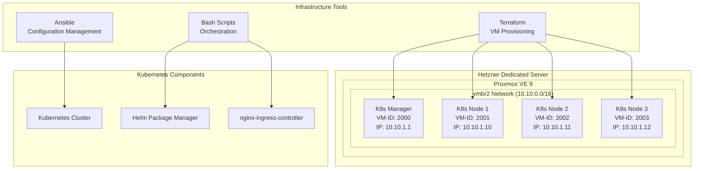

# Design Document - Proxmox Kubernetes Cluster Infrastructure

## Overview

Das sit-spark Infrastructure Repository implementiert eine vollautomatisierte Infrastructure-as-Code Lösung für die Bereitstellung eines produktionsfähigen Kubernetes Clusters auf Proxmox VE 9. Die Lösung kombiniert Terraform für die VM-Bereitstellung, Ansible für die Konfiguration und Bash-Scripts für die Orchestrierung.

## Architecture

### High-Level Architecture



### Technology Stack

- **Infrastructure Provisioning**: Terraform mit Proxmox Provider
- **Configuration Management**: Ansible
- **Orchestration**: Bash Scripts
- **Container Runtime**: containerd
- **Kubernetes Distribution**: kubeadm
- **Package Management**: Helm 3
- **Ingress Controller**: nginx-ingress-controller
- **Operating System**: Ubuntu 24.04 LTS

## Components and Interfaces

### 1. Terraform Infrastructure Module

**Purpose**: Automatisierte VM-Erstellung auf Proxmox

**Components**:
- `main.tf`: Hauptkonfiguration für Proxmox Provider
- `variables.tf`: Konfigurierbare Parameter
- `outputs.tf`: VM-Informationen für nachgelagerte Prozesse
- `versions.tf`: Provider-Versionen

**Key Interfaces**:
```hcl
# VM Configuration Interface
resource "proxmox_vm_qemu" "k8s_manager" {
  vmid        = var.manager_vm_id
  name        = "k8s-manager"
  target_node = var.proxmox_node
  
  network {
    bridge = "vmbr2"
    model  = "virtio"
  }
  
  ipconfig0 = "ip=${var.manager_ip}/16,gw=10.10.0.1"
}
```

### 2. Ansible Configuration Management

**Purpose**: Kubernetes Installation und Konfiguration

**Playbooks**:
- `site.yml`: Haupt-Playbook
- `k8s-common.yml`: Gemeinsame K8s-Konfiguration
- `k8s-manager.yml`: Control Plane Setup
- `k8s-nodes.yml`: Worker Node Setup

**Inventory Structure**:
```yaml
[k8s_manager]
10.10.1.1

[k8s_nodes]
10.10.1.10
10.10.1.11
10.10.1.12

[k8s_cluster:children]
k8s_manager
k8s_nodes
```

### 3. Helm Charts und Manifests

**Purpose**: Anwendungsbereitstellung und Ingress-Konfiguration

**Components**:
- `charts/`: Helm Charts für interne Anwendungen
- `manifests/`: Kubernetes Manifests
- `ingress/`: nginx-ingress-controller Konfiguration

### 4. Orchestration Scripts

**Purpose**: End-to-End Automatisierung

**Scripts**:
- `deploy.sh`: Haupt-Deployment-Script
- `destroy.sh`: Infrastruktur-Cleanup
- `validate.sh`: Cluster-Validierung

## Data Models

### VM Configuration Model

```yaml
vm_config:
  manager:
    vm_id: 2000
    ip: "10.10.1.1"
    cpu: 4
    memory: 8192
    disk: 50
  nodes:
    - vm_id: 2001
      ip: "10.10.1.10"
      cpu: 4
      memory: 8192
      disk: 50
    - vm_id: 2002
      ip: "10.10.1.11"
      cpu: 4
      memory: 8192
      disk: 50
    - vm_id: 2003
      ip: "10.10.1.12"
      cpu: 4
      memory: 8192
      disk: 50
```

### Kubernetes Cluster Model

```yaml
cluster_config:
  name: "sit-spark-k8s"
  version: "1.28"
  network:
    pod_subnet: "192.168.0.0/16"
    service_subnet: "10.96.0.0/12"
  ingress:
    class: "nginx"
    external_ip: "10.10.1.1"
```

## Error Handling

### Infrastructure Level

1. **Terraform State Management**:
   - Remote State Backend (falls verfügbar)
   - State Locking
   - Rollback-Mechanismen

2. **VM Creation Failures**:
   - Retry-Logic für VM-Erstellung
   - Resource-Cleanup bei Fehlern
   - Detaillierte Fehlerprotokollierung

3. **Network Configuration**:
   - IP-Konflikt-Erkennung
   - Gateway-Erreichbarkeits-Tests
   - DNS-Konfiguration-Validierung

### Kubernetes Level

1. **Cluster Initialization**:
   - kubeadm-Fehlerbehandlung
   - Node-Join-Retry-Logic
   - Certificate-Validierung

2. **Component Installation**:
   - Helm-Installation-Validierung
   - Ingress-Controller-Health-Checks
   - Pod-Readiness-Überwachung

3. **Application Deployment**:
   - Deployment-Status-Monitoring
   - Service-Erreichbarkeits-Tests
   - Ingress-Routing-Validierung

## Testing Strategy

### Infrastructure Testing

1. **Terraform Validation**:
   - `terraform validate`
   - `terraform plan` Dry-Run
   - Resource-Drift-Detection

2. **VM Connectivity Tests**:
   - SSH-Erreichbarkeit
   - Network-Konnektivität zwischen VMs
   - Internet-Zugang-Validierung

### Kubernetes Testing

1. **Cluster Health Tests**:
   - Node-Status-Überprüfung
   - System-Pod-Status
   - API-Server-Erreichbarkeit

2. **Application Testing**:
   - Sample-Deployment-Tests
   - Ingress-Routing-Tests
   - Service-Discovery-Tests

3. **Integration Tests**:
   - End-to-End-Deployment-Tests
   - Load-Balancing-Tests
   - Persistent-Volume-Tests

### Monitoring und Observability

1. **Cluster Monitoring**:
   - Node-Resource-Überwachung
   - Pod-Status-Monitoring
   - Network-Performance-Metriken

2. **Application Monitoring**:
   - HTTP-Response-Time-Monitoring
   - Error-Rate-Tracking
   - Resource-Usage-Alerts

## Security Considerations

1. **Network Security**:
   - Firewall-Regeln für Kubernetes-Ports
   - Network-Policies für Pod-Isolation
   - TLS-Verschlüsselung für alle Komponenten

2. **Access Control**:
   - RBAC-Konfiguration
   - Service-Account-Management
   - Secret-Management

3. **Image Security**:
   - Container-Image-Scanning
   - Trusted-Registry-Usage
   - Security-Policy-Enforcement