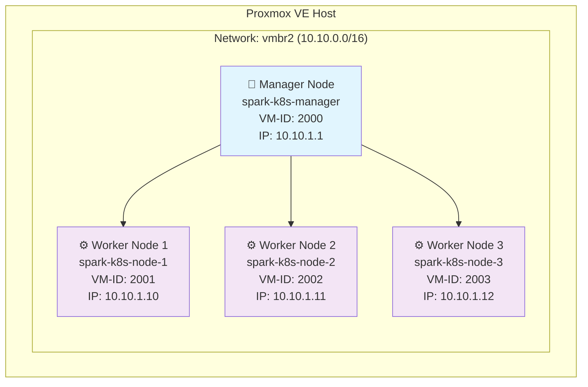

# 🚀 sit-spark Kubernetes Infrastructure

<div align="center">


**Vollautomatisierte Infrastructure-as-Code Lösung für Kubernetes auf Proxmox VE**

[🚀 Schnellstart](#-schnellstart) • [📖 Dokumentation](#-dokumentation) • [🛠️ Konfiguration](#️-konfiguration) • [🔧 Troubleshooting](#-troubleshooting)

</div>

---

## 📋 Überblick

Diese Repository stellt eine **vollständig automatisierte** Infrastructure-as-Code Lösung bereit, um einen produktionsreifen Kubernetes Cluster auf Proxmox VE zu deployen. Mit nur wenigen Befehlen erhalten Sie:

✅ **4 VMs** automatisch erstellt und konfiguriert  
✅ **Kubernetes Cluster** vollständig installiert  
✅ **NGINX Ingress Controller** für externe Zugriffe  
✅ **Helm** für Package Management  
✅ **Cloud-init** für automatische VM-Konfiguration  
✅ **SSH-Zugang** mit Key- und Passwort-Authentifizierung  
✅ **Monitoring & Validierung** Scripts  

## 🏗️ Architektur



### 🖥️ VM-Spezifikationen

| Komponente | Manager Node | Worker Nodes |
|------------|--------------|--------------|
| **Hostname** | `spark-k8s-manager` | `spark-k8s-node-{1-3}` |
| **VM-ID** | 2000 | 2001-2003 |
| **IP-Adresse** | 10.10.1.1 | 10.10.1.10-12 |
| **CPU** | 4 Cores | 4 Cores |
| **RAM** | 8 GB | 8 GB |
| **Disk** | 50 GB | 50 GB |
| **OS** | Ubuntu 24.04 LTS | Ubuntu 24.04 LTS |

## 🚀 Schnellstart

### 📋 Voraussetzungen

<details>
<summary><strong>🖥️ Software Requirements</strong></summary>

- **Terraform** >= 1.0
- **Ansible** >= 2.9
- **SSH Client** (OpenSSH empfohlen)
- **Git**
- **Bash/PowerShell** (je nach OS)

</details>

<details>
<summary><strong>🏠 Proxmox VE Setup</strong></summary>

- **Proxmox VE** >= 8.0 installiert
- **Ubuntu 24.04 LTS Cloud-Init Template** erstellt
- **Netzwerk Bridge** `vmbr2` konfiguriert
- **API-Benutzer** mit VM-Verwaltungsrechten
- **SSH-Zugang** zum Proxmox Host

</details>

### ⚡ Quick Deploy

```bash
# 1. Repository klonen
git clone <repository-url>
cd sit-spark-infrastructure

# 2. SSH-Key generieren (falls nicht vorhanden)
ssh-keygen -t rsa -b 4096 -C "your-email@example.com"

# 3. Terraform Konfiguration anpassen
cp terraform/terraform.tfvars.example terraform/terraform.tfvars
# Bearbeiten Sie terraform/terraform.tfvars mit Ihren Details

# 4. Cloud-init Dateien generieren und hochladen
cd terraform
terraform init
terraform plan
# Windows:
../scripts/upload-cloud-init.ps1
# Linux/macOS:
bash ../scripts/upload-all-cloud-init.sh

# 5. Vollständiges Deployment
bash scripts/deploy.sh

# 6. Cluster validieren
bash scripts/validate.sh
```

## 📁 Projektstruktur

```
sit-spark-infrastructure/
├── 📂 terraform/                    # Infrastructure as Code
│   ├── 📄 main.tf                  # VM-Definitionen
│   ├── 📄 variables.tf             # Terraform Variablen
│   ├── 📄 terraform.tfvars         # Konfigurationswerte
│   ├── 📄 providers.tf             # Provider Konfiguration
│   ├── 📄 outputs.tf               # Output Definitionen
│   ├── 📄 cloud-init-template.yml  # Cloud-init Template
│   └── 📂 cloud-init/              # Generierte Cloud-init Dateien
├── 📂 ansible/                     # Configuration Management
│   ├── 📂 playbooks/               # Kubernetes Installation
│   │   ├── 📄 k8s-common.yml      # Basis-Setup
│   │   ├── 📄 k8s-manager.yml     # Manager Konfiguration
│   │   ├── 📄 k8s-nodes.yml       # Worker Konfiguration
│   │   ├── 📄 k8s-helm.yml        # Helm Installation
│   │   └── 📄 k8s-ingress.yml     # Ingress Controller
│   ├── 📂 inventory/               # Ansible Inventories
│   ├── 📂 group_vars/              # Ansible Variablen
│   └── 📂 files/                   # Konfigurationsdateien
├── 📂 scripts/                     # Automation Scripts
│   ├── 🚀 deploy.sh               # Haupt-Deployment Script
│   ├── 🗑️ destroy.sh              # Cleanup Script
│   ├── ✅ validate.sh              # Validierung
│   ├── 🔧 debug-cloud-init.sh     # Debug Tools
│   ├── 📤 upload-cloud-init.sh    # Cloud-init Upload (Linux)
│   └── 📤 upload-cloud-init.ps1   # Cloud-init Upload (Windows)
├── 📂 manifests/                   # Kubernetes Manifests
│   └── 📂 ingress-examples/        # Beispiel-Anwendungen
└── 📄 README.md                    # Diese Datei
```

## 🛠️ Konfiguration

### 🔧 Terraform Konfiguration

Bearbeiten Sie `terraform/terraform.tfvars`:

```hcl
# Proxmox Connection
proxmox_api_url      = "https://YOUR-PROXMOX-IP:8006/api2/json"
proxmox_user         = "root@pam"
proxmox_password     = "YOUR-PASSWORD"
proxmox_node         = "YOUR-NODE-NAME"

# VM Configuration
manager_vm_id = 2000
manager_ip    = "10.10.1.1"
node_vm_ids   = [2001, 2002, 2003]
node_ips      = ["10.10.1.10", "10.10.1.11", "10.10.1.12"]

# Resources
vm_cpu        = 4
vm_memory     = 8192
vm_disk_size  = "50G"

# Network
network_bridge  = "vmbr2"
network_gateway = "10.10.0.1"
dns_servers     = "8.8.8.8 1.1.1.1"

# SSH Key (Ihr kompletter öffentlicher SSH-Schlüssel)
ssh_public_key = "ssh-rsa AAAAB3NzaC1yc2EAAAADAQABAAABAQC... your-key"
```

### ⚙️ Ansible Konfiguration

Anpassungen in `ansible/group_vars/all.yml`:

```yaml
# Kubernetes Configuration
kubernetes_version: "1.28"
pod_network_cidr: "10.244.0.0/16"
service_subnet: "10.96.0.0/12"

# Ingress Configuration
ingress_class: "nginx"
ingress_replicas: 2

# Additional packages
extra_packages:
  - htop
  - vim
  - curl
  - wget
```

## 🎯 Verwendung

### 🚀 Deployment Optionen

```bash
# Vollständiges Deployment
bash scripts/deploy.sh

# Nur Infrastructure (Terraform)
bash scripts/deploy.sh --terraform-only

# Nur Konfiguration (Ansible)
bash scripts/deploy.sh --ansible-only

# Mit ausführlicher Ausgabe
bash scripts/deploy.sh --verbose

# Erzwinge Neustart (zerstört existierende Infrastruktur)
bash scripts/deploy.sh --force-destroy
```

### 📊 Cluster Management

```bash
# Cluster Status
ssh ubuntu@10.10.1.1 "kubectl get nodes -o wide"

# Alle Pods anzeigen
ssh ubuntu@10.10.1.1 "kubectl get pods --all-namespaces"

# Ingress Controller Status
ssh ubuntu@10.10.1.1 "kubectl get pods -n ingress-nginx"

# Cluster Informationen
ssh ubuntu@10.10.1.1 "kubectl cluster-info"

# Hostnames prüfen
ssh ubuntu@10.10.1.1 "hostname"    # spark-k8s-manager
ssh ubuntu@10.10.1.10 "hostname"   # spark-k8s-node-1
ssh ubuntu@10.10.1.11 "hostname"   # spark-k8s-node-2
ssh ubuntu@10.10.1.12 "hostname"   # spark-k8s-node-3
```

### 🌐 Anwendungen Deployen

```bash
# NextJS Beispiel-App
kubectl apply -f manifests/ingress-examples/nextjs-example.yml

# REST API Beispiel
kubectl apply -f manifests/ingress-examples/rest-api-example.yml

# Umfassende Test-Suite
kubectl apply -f manifests/ingress-examples/comprehensive-test-suite.yml
```

### 🔍 Monitoring & Logs

```bash
# Ingress Tests ausführen
bash scripts/test-ingress-comprehensive.sh

# Cloud-init Status prüfen
bash scripts/debug-cloud-init.sh 10.10.1.1

# Deployment Logs
tail -f deployment.log
```

## 🔧 Troubleshooting

### 🚨 Häufige Probleme

<details>
<summary><strong>❌ SSH-Verbindung fehlgeschlagen</strong></summary>

**Problem**: Kann nicht per SSH auf VMs zugreifen

**Lösungen**:
```bash
# 1. Cloud-init Status prüfen
bash scripts/debug-cloud-init.sh 10.10.1.1

# 2. Passwort-Login versuchen
ssh ubuntu@10.10.1.1
# Passwort: ubuntu

# 3. SSH-Key prüfen
cat ~/.ssh/id_rsa.pub
# Key in terraform.tfvars aktualisieren
```

</details>

<details>
<summary><strong>❌ Cloud-init Dateien fehlen</strong></summary>

**Problem**: `volume 'local:snippets/user-data-k8s-manager.yml' does not exist`

**Lösung**:
```bash
# 1. Cloud-init Dateien generieren
cd terraform
terraform plan

# 2. Dateien zu Proxmox hochladen
# Windows:
../scripts/upload-cloud-init.ps1 -Force
# Linux:
bash ../scripts/upload-all-cloud-init.sh --force
```

</details>

<details>
<summary><strong>❌ Terraform Provider Fehler</strong></summary>

**Problem**: Provider Dependency Lock File Fehler

**Lösung**:
```bash
cd terraform
terraform init -upgrade
```

</details>

<details>
<summary><strong>❌ Kubernetes Installation fehlgeschlagen</strong></summary>

**Problem**: Ansible Playbook schlägt fehl

**Lösungen**:
```bash
# 1. SSH-Konnektivität testen
ansible all -m ping

# 2. Verbose Ansible ausführen
ansible-playbook -vvv ansible/site.yml

# 3. Einzelne Playbooks testen
ansible-playbook ansible/playbooks/k8s-common.yml
```

</details>

<details>
<summary><strong>❌ Hostname nicht korrekt gesetzt</strong></summary>

**Problem**: VMs haben falsche Hostnames

**Lösung**:
```bash
# 1. Cloud-init Template prüfen
cat terraform/cloud-init-template.yml | grep hostname

# 2. Cloud-init Dateien neu generieren
cd terraform
terraform apply -target="local_file.cloud_init_user_data_manager" -target="local_file.cloud_init_user_data_nodes"

# 3. Dateien zu Proxmox hochladen
bash ../scripts/upload-all-cloud-init.sh --force

# 4. VMs neu erstellen
terraform apply
```

</details>

### 🔍 Debug Commands

```bash
# VM Status auf Proxmox prüfen
ssh root@PROXMOX-IP "qm list"

# Cloud-init Logs auf VM
ssh ubuntu@10.10.1.1 "sudo cloud-init status --long"
ssh ubuntu@10.10.1.1 "sudo tail -50 /var/log/cloud-init.log"

# Netzwerk-Konfiguration prüfen
ssh ubuntu@10.10.1.1 "ip addr show"
ssh ubuntu@10.10.1.1 "cat /etc/resolv.conf"

# Hostname-Konfiguration prüfen
ssh ubuntu@10.10.1.1 "hostname"
ssh ubuntu@10.10.1.1 "cat /etc/hostname"
ssh ubuntu@10.10.1.1 "cat /etc/hosts"

# Kubernetes Cluster Debug
ssh ubuntu@10.10.1.1 "kubectl get nodes -o yaml"
ssh ubuntu@10.10.1.1 "kubectl describe node spark-k8s-manager"
```

## 🗑️ Cleanup

### 🧹 Vollständige Bereinigung

```bash
# Interaktive Bereinigung mit Backup
bash scripts/destroy.sh

# Schnelle Bereinigung ohne Backup
bash scripts/destroy.sh --skip-backup --force

# Nur VMs löschen (Terraform State behalten)
bash scripts/destroy.sh --vms-only
```

### 🔄 Selektive Bereinigung

```bash
# Nur Kubernetes Workloads entfernen
ssh ubuntu@10.10.1.1 "kubectl delete all --all -A"

# Nur Terraform Infrastruktur
cd terraform
terraform destroy
```

## 📚 Erweiterte Features

### 🔐 Sicherheit

- **SSH Key Authentication** für sichere Verbindungen
- **Passwort Authentication** als Fallback (ubuntu/ubuntu)
- **Firewall Konfiguration** automatisch eingerichtet
- **Network Segmentation** durch Proxmox VLANs
- **RBAC** für Kubernetes Cluster

### 🌐 Netzwerk-Features

- **Automatische IP-Konfiguration** über Proxmox Cloud-init
- **DNS-Server Konfiguration** (8.8.8.8, 1.1.1.1)
- **Hostname-Management** mit eindeutigen Namen
- **Network Policy** Support für Kubernetes

### 📈 Skalierung

```bash
# Zusätzliche Worker Nodes hinzufügen
# 1. terraform.tfvars erweitern
node_vm_ids = [2001, 2002, 2003, 2004]
node_ips = ["10.10.1.10", "10.10.1.11", "10.10.1.12", "10.10.1.13"]

# 2. Terraform anwenden
terraform plan
terraform apply

# 3. Ansible für neue Nodes ausführen
ansible-playbook ansible/playbooks/k8s-nodes.yml
```

### 🔄 Backup & Recovery

```bash
# Automatisches Backup vor Destroy
bash scripts/destroy.sh
# Backup wird in backups/ gespeichert

# Cluster Backup manuell
ssh ubuntu@10.10.1.1 "kubectl get all -A -o yaml > cluster-backup.yaml"

# Kubeconfig Backup
scp ubuntu@10.10.1.1:/root/.kube/config ./kubeconfig-backup
```

### 🔧 Cloud-init Features

- **Dynamische Hostname-Generierung** pro VM
- **SSH-Key Injection** aus Terraform Variablen
- **Automatische Package Installation**
- **Kubernetes-spezifische Systemkonfiguration**
- **Network Configuration Delegation** an Proxmox

## 🎛️ Erweiterte Konfiguration

### 🔧 Cloud-init Anpassungen

Die Cloud-init Konfiguration wird dynamisch aus `terraform/cloud-init-template.yml` generiert:

```yaml
# Beispiel für erweiterte Cloud-init Konfiguration
hostname: ${hostname}
fqdn: ${hostname}.local

# Netzwerk-Konfiguration von Proxmox verwalten lassen
network:
  config: disabled

# Benutzerdefinierte Pakete
packages:
  - your-custom-package

# Zusätzliche Dateien
write_files:
  - path: /etc/custom-config.conf
    content: |
      your custom configuration
    permissions: '0644'
```

### 🎯 Terraform Outputs

Nach dem Deployment stehen folgende Outputs zur Verfügung:

```bash
# Terraform Outputs anzeigen
cd terraform
terraform output

# Beispiel Outputs:
# manager_ip = "10.10.1.1"
# node_ips = ["10.10.1.10", "10.10.1.11", "10.10.1.12"]
# manager_ssh_connection = "ssh ubuntu@10.10.1.1"
# ansible_inventory = {...}
```

## 🤝 Beitragen

1. **Fork** das Repository
2. **Feature Branch** erstellen (`git checkout -b feature/amazing-feature`)
3. **Änderungen committen** (`git commit -m 'Add amazing feature'`)
4. **Branch pushen** (`git push origin feature/amazing-feature`)
5. **Pull Request** erstellen

### 📝 Entwicklungsrichtlinien

- **Code Style**: Befolgen Sie die bestehenden Konventionen
- **Dokumentation**: Aktualisieren Sie die README bei Änderungen
- **Tests**: Testen Sie Ihre Änderungen vor dem Commit
- **Commits**: Verwenden Sie aussagekräftige Commit-Nachrichten

## 📄 Lizenz

Dieses Projekt ist unter der [MIT Lizenz](LICENSE) lizenziert.

## 🆘 Support

<div align="center">

**Benötigen Sie Hilfe?**

[](https://github.com/your-repo/issues)
[](https://github.com/your-repo/discussions)
[](mailto:support@schnebel-it.de)

**Häufige Support-Themen:**
- 🔧 Terraform/Ansible Konfiguration
- 🐛 Cloud-init Probleme
- 🌐 Netzwerk-Setup
- 🔐 SSH-Authentifizierung
- ⚙️ Kubernetes Cluster Management

</div>

---

<div align="center">

**Erstellt mit ❤️ von [Schnebel-IT Team](https://schnebel-it.de)**

⭐ **Gefällt Ihnen das Projekt? Geben Sie uns einen Stern!** ⭐

</div>